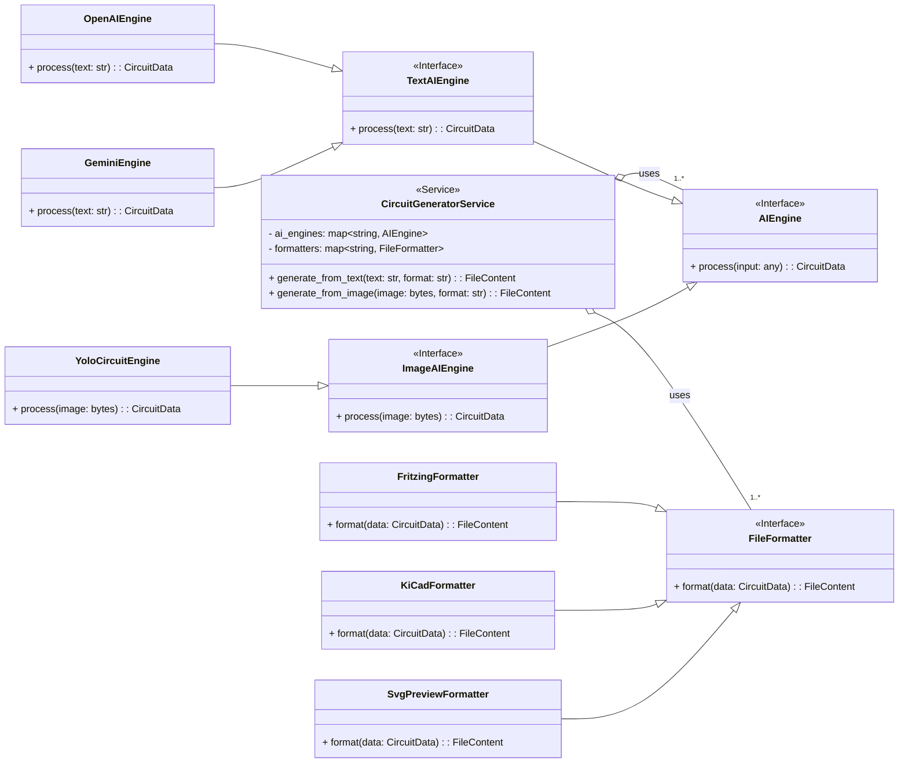
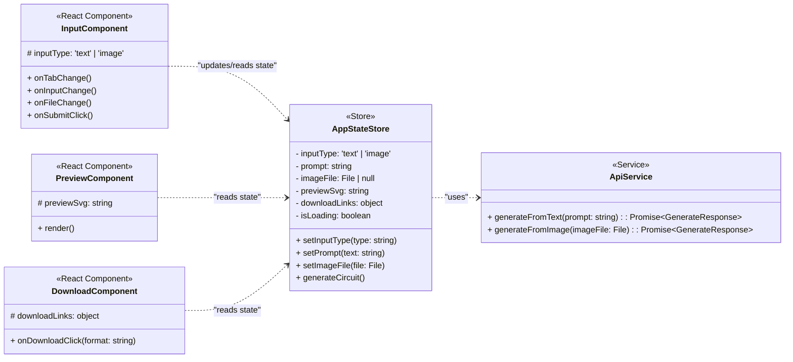

このドキュメントは、アプリケーションのソフトウェアアーキテクチャをUMLクラス図で表現したものです。保守性・拡張性の高い設計を目指します。
1. バックエンドアーキテクチャ

設計方針:

    Strategy パターンを採用し、AIモデルとファイル出力形式を「戦略」としてカプセル化し、動的に付け替え可能にします。

    インターフェース（抽象基底クラス）を定義することで、将来的に新しいAIモデル（自作のYOLOモデルなど）や新しいファイル形式を追加する際に、主要なロジックを変更する必要がない構造とします。

クラス図:

図の解説:

    CircuitGeneratorService: FastAPIのAPIエンドポイントから呼び出される中心的なサービスです。AIエンジンとフォーマッターを管理します。

    AIEngine (インターフェース): すべてのAIモデルが実装すべき共通のインターフェースです。TextAIEngineとImageAIEngineに分けることで、入力の種類を明確にします。

    OpenAIEngine, GeminiEngine, YoloCircuitEngine: AIEngineインターフェースの具体的な実装クラスです。新しいAIを追加したい場合は、このインターフェースを実装した新しいクラスを作るだけで済みます。

    FileFormatter (インターフェース): すべての出力形式ジェネレーターが実装すべき共通のインターフェースです。

    FritzingFormatter, KiCadFormatter: FileFormatterインターフェースの具体的な実装クラスです。Draw.ioや他の形式に対応する場合も、同様にクラスを追加します。

2. フロントエンドアーキテクチャ

設計方針:

    UIコンポーネント、状態管理、API通信の役割を明確に分離し、関心事を分離します。

    コンポーネントは状態管理ストアからデータを取得して表示し、ユーザー操作をストアに通知します。

    状態管理ストアがAPIサービスクラスを介してバックエンドとの通信ロジックを担当します。

クラス図:

図の解説:

    React Components: ユーザーインターフェースを構成する各部品です。InputComponent（入力欄）、PreviewComponent（プレビュー表示）、DownloadComponent（ダウンロードボタン）に分かれています。

    AppStateStore: アプリケーション全体の状態（入力モード、入力された文章やアップロードされた画像ファイル、プレビューSVG、読み込み状態など）を一元管理します。ZustandやReact Contextがこの役割を担います。

    ApiService: バックエンドとのHTTP通信を専門に担当するクラスです。コンポーネントが直接fetchを呼ぶのではなく、このクラスを介して通信することで、テキスト用と画像用のAPIを呼び分けます。
